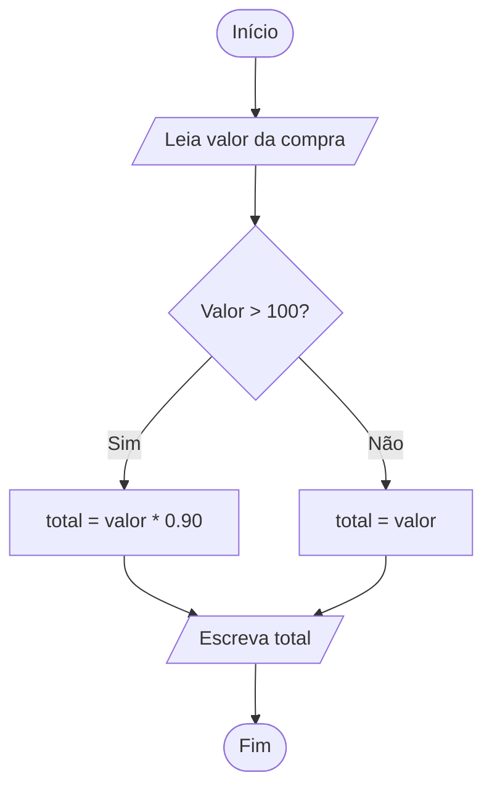

Exercício 3 — Fluxograma
Monte um fluxograma para o seguinte problema:

“Uma loja dá desconto de 10% para compras acima de R$ 100. Leia o valor da compra e
mostre o valor final a pagar.”

Dica: use o losango para a decisão ( Valor > 100? ) com os dois caminhos Sim e Não.

----------------------------------------------------------------------------------------

