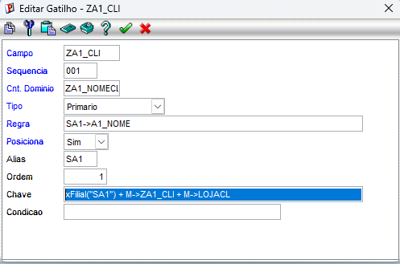
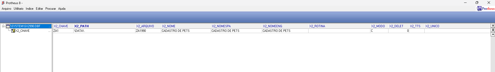
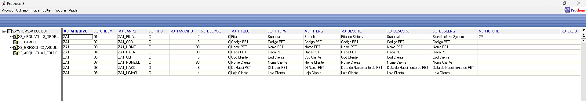
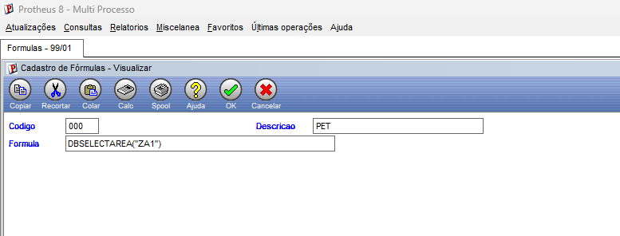
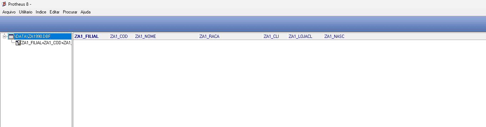

a. Cadastro da estrutura no dicionário (SX2/SX3)

Inicialmente, foi criada a tabela ZA1 no dicionário de dados do Protheus e, em seguida, foram cadastrados os campos da tabela no SX3, conforme a estrutura abaixo.

| Campo      | Tipo          | Tamanho | Descrição                 | Real/Virtual |
| ---------- | ------------- | :-----: | ------------------------- | ------------ |
| ZA1_FILIAL | Caractere (C) |    2    | Filial                    | Real         |
| ZA1_COD    | Caractere (C) |    6    | Código PET                | Real         |
| ZA1_NOME   | Caractere (C) |    30   | Nome do pet               | Real         |
| ZA1_RACA   | Caractere (C) |    30   | Raça do pet               | Real         |
| ZA1_CLI    | Caractere (C) |    6    | Código do Cliente         | Real         |
| ZA1_LOJACL | Caractere (C) |    4    | Loja do Cliente           | Real         |
| ZA1_NOMECL | Caractere (C) |    60   | Nome do Cliente           | Virtual      |
| ZA1_NASC   | Data (D)      |    8    | Data de nascimento do pet | Real         |

Além dos campos reais, foi criado o campo ZA1_NOMECL como campo virtual, responsável apenas pela apresentação do nome do cliente na tela. Para isso, foi configurado um gatilho para que, após a informação dos campos ZA1_CLI e ZA1_LOJACL, o sistema realize automaticamente a busca do nome do cliente na tabela SA1. Como esse campo é apenas informativo, ele foi definido como virtual e não editável, impedindo alterações manuais pelo usuário.



Também foi criado o índice primário da tabela, utilizando a composição Filial + Código do Pet + Nome do Pet (ZA1_FILIAL + ZA1_COD + ZA1_NOME), permitindo uma melhor organização dos registros e facilitando sua localização durante as consultas no sistema.

Print da estrutura criada na SX2/SX3:






----------------------------------------------------------------------------------------------------------------------

b. Reconhecimento da tabela pelo framework

Após o cadastro da estrutura, foi utilizada a rotina de Fórmulas para que o framework do Protheus reconhecesse a nova tabela. Para criar fisicamente a tabela no banco de dados, foi utilizada a função abaixo:

```advpl
DBSelectArea("ZA1")
```

Ao compilar a fórmula contendo essa chamada, o framework reconheceu a estrutura cadastrada no dicionário e criou a tabela física correspondente no sistema.

Print da rotina de Fórmulas:



----------------------------------------------------------------------------------------------------------------------

c. Conferência da estrutura no MPSDU

Após a criação da tabela, foi realizada a conferência da estrutura no MPSDU, verificando que todos os campos foram criados corretamente conforme definido no dicionário de dados.

Segue abaixo a imagem da estrutura da tabela no MPSDU.


