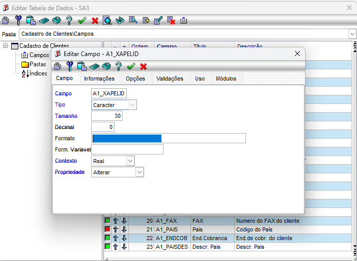
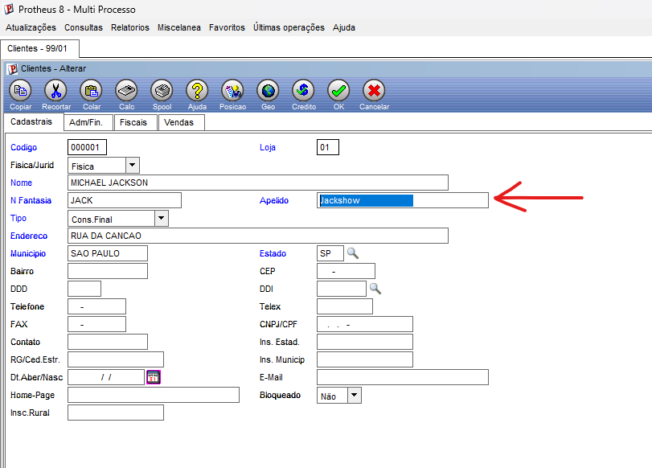

a. Criação do campo no Configurador (SX3)

Inicialmente, foi acessado o Configurador para realizar a criação de um novo campo customizado na tabela SA1.

Foi criado o campo A1_XAPELID, responsável por armazenar o apelido do cliente, com a seguinte definição:

| Campo       | Tipo          | Tamanho | Título          | Descrição          |
|-------------|---------------|:-------:|-----------------|--------------------|
| A1_XAPELID  | Caractere (C) | 30      | Apelido Cliente | Apelido do cliente |

Após salvar a alteração no dicionário, o Protheus passou a reconhecer o campo dentro da tabela SA1. Após isso adicionei o campo na pasta de cadastrais.

Print da criação do campo no Configurador:

----------------------------------------------------------------------------------------------------

b. Apresentação do campo no SmartClient

Após a criação do campo no Configurador, foi acessado o SmartClient para verificar a atualização do cadastro de clientes.

O campo A1_XAPELID passou a ser apresentado na posição 7 automaticamente na tela do cadastro da SA1, sem a necessidade de criação de nenhuma linha de código.

Print do campo aparecendo no SmartClient:

