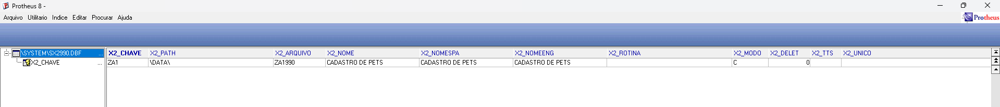
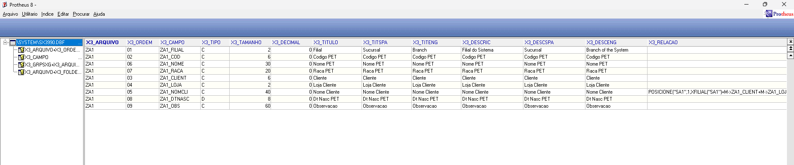
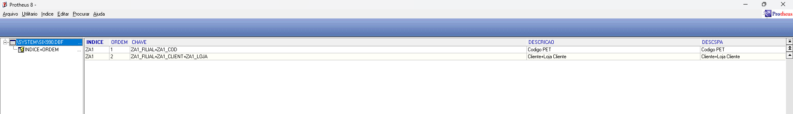

Cadastro da tabela (SX2):

| Descrição         | Campo       | Tipo | Tam | Dec | Contexto |
|-------------------|------------|------|-----|-----|----------|
| Filial            | ZA1_FILIAL | C    | 2   | 0   | Real     |
| Código            | ZA1_COD    | C    | 6   | 0   | Real     |
| Cliente (dono)    | ZA1_CLIENT | C    | 6   | 0   | Real     |
| Loja do cliente   | ZA1_LOJA   | C    | 2   | 0   | Real     |
| Nome do cliente   | ZA1_NOMCLI | C    | 40  | 0   | Virtual  |
| Nome do pet       | ZA1_NOME   | C    | 30  | 0   | Real     |
| Raça              | ZA1_RACA   | C    | 20  | 0   | Real     |
| Nascimento        | ZA1_DTNASC | D    | 8   | 0   | Real     |
| Observação        | ZA1_OBS    | C    | 60  | 0   | Real     |

Campos da tabela (SX3): cadastrados todos os campos com os tipos e tamanhos corretos — ZA1_FILIAL, ZA1_COD, ZA1_CLIENT, ZA1_LOJA, ZA1_NOME, ZA1_RACA, ZA1_DTNASC e ZA1_OBS, todos como Real. O campo ZA1_NOMCLI foi configurado como Virtual, com a relação:

POSICIONE("SA1",1,xFilial("SA1")+M->ZA1_CLIENT+M->ZA1_LOJA,"A1_NOME")

Esse campo não é gravado no banco. Ele busca o nome do cliente na SA1 sempre que o registro é exibido, usando ZA1_CLIENT e ZA1_LOJA como chave de busca.

Índices (SIX): criados os dois índices. O índice 1 (ZA1_FILIAL + ZA1_COD) como chave primária da tabela, e o Índice 2 (ZA1_FILIAL + ZA1_CLIENT + ZA1_LOJA) para permitir a busca de todos os pets de um cliente específico.

